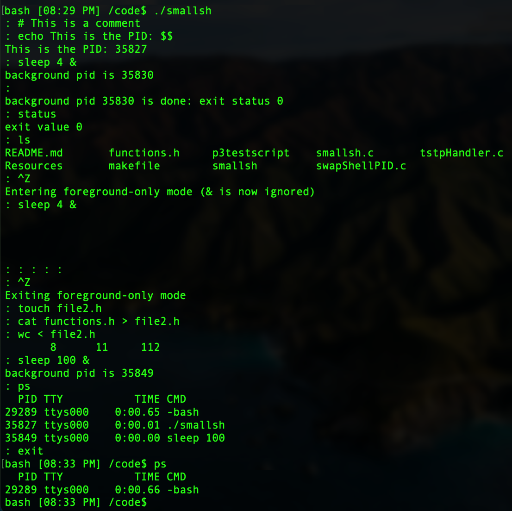

# DIY Shell

###### Create a shell with a prompt, built in commands (exit, cd, status), command execution using child processes, redirection of stdin and stdout, ability to run foreground and background processes, and signal handling

## Requirements
- gcc compiler

## Usage
Compile program and clean up object files: `make` 

Run the small shell program: `./smallsh`
  - Accepts up to 100 arguments and 2048 characters per line.
  - `cd` with no args goes to `HOME` directory
  - `cd <path>` acts like normal cd <path> in bash shell
  - `status` returns 0 if previous command exited successfully, 1 if unsuccessful
  - `exit` terminates the program and exits the shell
  - All other commands use fork() and exec() to run.

  Special symbols
  - `#` ignores lines that start with #
  - `<` redirects stdin to the file
    - e.g. `wc < file1.txt`
  - `>` redirects stdout to the file
    - e.g. `cat file1.txt > file2.txt`
  - `&` puts the process in the background
    - e.g. `sleep 100 &`
  - All instances of `$$` in a command will be replaced by the process ID of the current process (parent or child)
    - e.g. `echo $$` outputs "22532"

Signals
- The SIGTSTP (ctrl-Z) signal enters foreground only mode on odd calls. This mode ignores the background symbol `&`. Send the SIGTSTP again to exit foreground only mode.

- When in foreground only mode, you can terminate the process by sending the SIGINT (ctrl-C) signal on your keyboard.

## Output
 You will see the `: ` prompt

 If the command failed to execute with exec(), the program with print `CHILD exec() process failed!`

#### Test Script

Run p3testscript for a full test
1. `./p3testscript`
